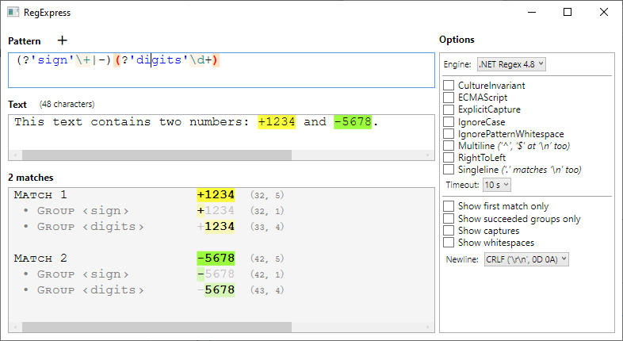

# RegExpress
Tester for Regular Expressions.

A .NET desktop application made in C#, based on Windows Presentation Foundation (WPF).

It includes several Regular Expression engines:

* **_Regex_** class from .NET Framework 4.8
* **_basic_regex_** generic class from Standard Template Library, MSVC 14.24.28314
* **Boost.Regex** from Boost C++ Libraries 1.72.0
* **PCRE2** Open Source Regex Library 10.34
* **RE2** C++ Library 2020-01-01 from Google 

Sample:

 

 

You can press “➕” to open more tabs.

The contents is saved and reloaded automatically.

 

* [Download Latest Release](https://github.com/Viorel/RegExpress/releases/latest)

 
