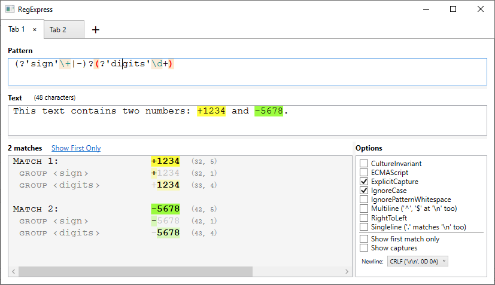

# RegExpress
Tester for Regular Expressions.

A .NET desktop application made in C#, based on Windows Presentation Foundation (WPF) and Regex class.

Sample:

 

 

You can press “➕” to open more tabs.

The contents is saved and reloaded automatically.

 

* [Download Latest Release](https://github.com/Viorel/RegExpress/releases/latest)

 
